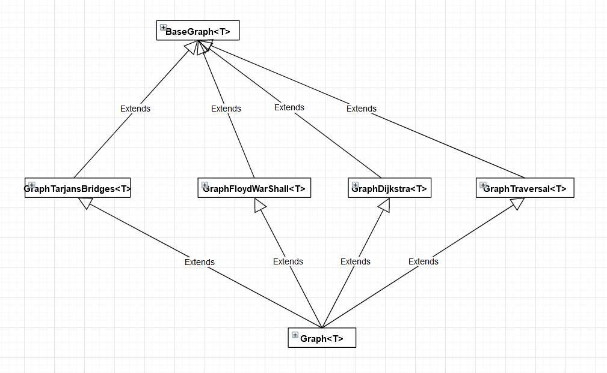

# Graph

Реализация графа с поддержкой распространенных алгоритмов
для этой структуры данных (поиск кратчайшего пути, поиск мостов и т.д.).

Структура этой реализации выглядит следующим образом:

Базовый класс `BaseGraph` реализует поля для хранения информации о графе
и основные методы. Производные от этого класса (например, `GraphTarjansBridges`) реализуют какие-то конкретные алгоритмы
для работы с графом. Основной класс `Graph` наследуется от графов с алгоритмами и содержит в себе все реализации алгоритмов.

В папке `tests` располагаются тесты, которые подключаются с помощью CMake в файле `CMakeLists.txt`.

